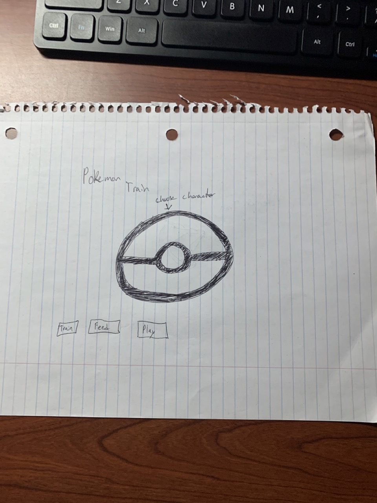

:warning: Everything between << >> needs to be replaced (remove << >> after replacing)

#  PokePals
## CS110 Final Project  CS 110 Fall Semester, 2024

## Team Members

Jacob Chow

## Project Description

Tamagotchi style game. Selection of different characters, i'm thinking pokemon. You can train, feed, play etc with characters. Each action has different animations and characters level up. Evolve after enough actions/care by player. 

## GUI Design

### Initial Design

### Final Design

## Program Design

### Citation

This project requires the following Python modules:

- `pygame` : [pygame documentation](https://www.pygame.org/)

- `pygame` : Pygame Community. "Pygame - Python Game Development." Pygame, 2020. [https://www.pygame.org](https://www.pygame.org).

### Features

1. Background music 
2. Character selection 
3. Action selection (feed, play, train) 
4. Character reactions to player actions 
5. Evolution, character evolves after certain amount of player input/care 
6. Statistics on actions done 

### Classes

Controller class - Manages game flow, user interactions, Pokémon selection, and actions
Pokemon class - Represents Pokémon, level, evolution, and image
Stats class - Tracks data on evolutions and number of actions taken

## ATP
Test Case 1: Level increase

Test Description: Verify that the Pokémon levels up when you do an action. 
Test Steps:
Start the game.
Choose a Pokémon.
Press either Q, W, or E key. 

Expected Outcome: Pokémon level should increase by one in top left corner and level up text should display in terminal. 

Test Case 2: Pokémon Evolution

Test Description: Ensure that Pokémon evolve when reaching the correct level (10 and 25).
Test Steps:
Start the game.
Select a Pokémon 
Perform enough actions (Feed, Play, or Train) to increase the Pokémon's level past 10 or 25.

Expected Outcome: Pokémon should evolve once it reaches the correct level. The terminal should display an evolution message.

Test Case 3: Action cooldown (Wait time)

Test Description: Verify that the player must wait 10 seconds between actions.
Test Steps:
Start the game and select a Pokémon.
Perform an action (Feed, Play, or Train).
Attempt to perform the same action again before 10 seconds have passed.

Expected Outcome: The game should prevent performing the action again too soon, and the terminal should display a message like "Please wait before performing this action again."

Test Case 4: Stats Display

Test Description: Verify that stats (evolutions and actions) are displayed every 20 seconds in the terminal.
Test Steps:
Start the game.
Select a Pokémon and perform some actions (Feed, Play, or Train).
Wait 20 seconds and observe the terminal output.

Expected Outcome: The terminal should display the stats every 20 seconds, showing the number of evolutions and the number of times each action has been performed.

Test Case 5: Game Background and Icons Display

Test Description: Ensure that the background image and action icons are displayed correctly on the screen.

Test Steps:
Start the game.
Select a Pokémon.
Observe the graphical elements on the screen.

Expected Outcome: The background image should fill the screen, and action icons should be displayed under the Pokémon's image. The game should not crash or display missing images.

