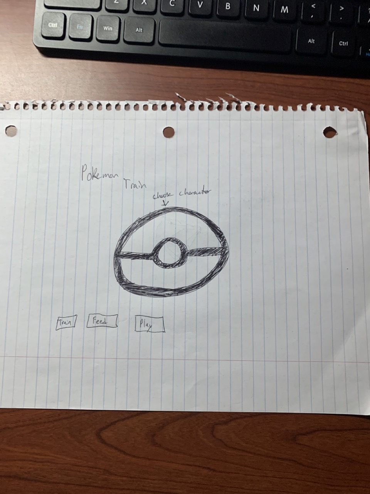

:warning: Everything between << >> needs to be replaced (remove << >> after replacing)

# << Project Title >>
## CS110 Final Project  << Semester, Year >>

## Team Members

<< List team member names >>
Jacob Chow
***

## Project Description

<< Give an overview of your project >>
Tamagotchi style game. Selection of different characters, i'm thinking pokemon. You can train, feed, play etc with characters. Each action has different animations and characters level up. Evolve after enough actions/care by player. 
***    

## GUI Design

### Initial Design

### Final Design

## Program Design

### Features

1. << Start menu >>
2. << Character selection >>
3. << Action selection (feed, play, train) >>
4. << Character reactions to player actions >>
5. << Personalization features (naming, background) >>
6. << Evolution, character evolves after certain amount of player input/care >>

### Classes

- << You should have a list of each of your classes with a description >>

## ATP

| Step                 |Procedure             |Expected Results                   |
|----------------------|:--------------------:|----------------------------------:|
|  1                   | Run Counter Program  |GUI window appears with count = 0  |
|  2                   | click count button   | display changes to count = 1      |
etc...
